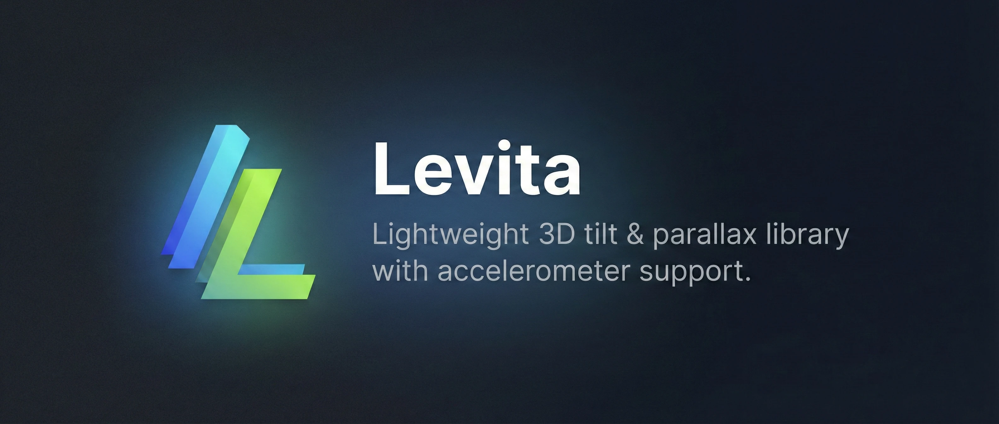
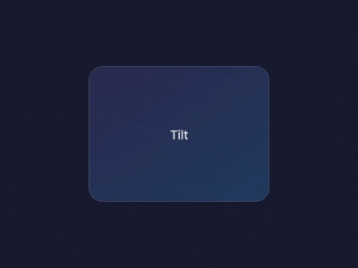
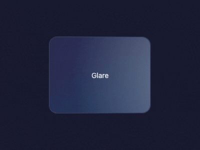
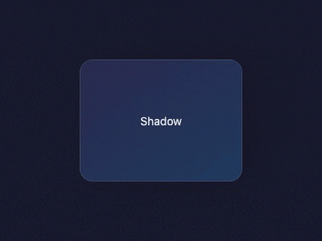
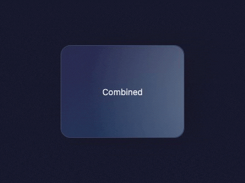

<!-- markdownlint-disable MD033 MD041 -->

<p align="center">
  <a href="https://github.com/Jeromearsene/levita">
    
  </a>
</p>

<p align="center">
  <a href="https://github.com/Jeromearsene/levita/actions/workflows/ci.yml"></a>
  <a href="https://www.npmjs.com/package/levita-js"></a>
  <a href="https://www.npmjs.com/package/levita-js"></a>
  <a href="https://github.com/Jeromearsene/levita/actions/workflows/ci.yml"></a>
  <a href="./LICENSE"></a>
  <a href="https://Jeromearsene.github.io/levita/"></a>
</p>

- **CSS-driven** — No `requestAnimationFrame` loop. CSS custom properties + compositor = GPU-accelerated.
- **~2KB gzipped** — Core engine only.
- **Accelerometer** — Auto-detects gyroscope, handles iOS permissions transparently.
- **Multi-layer parallax** — `data-levita-offset` on children for depth layering.
- **React, Vue & Svelte** — First-class wrappers with identical API.

## Effects

| Tilt | Glare |
|:----:|:-----:|
|  |  |
| **Shadow** | **Combined** |
|  |  |

## Install

```bash
# Core (vanilla JS/TS)
npm install levita-js

# React wrapper
npm install @levita-js/react

# Vue wrapper
npm install @levita-js/vue

# Svelte wrapper
npm install @levita-js/svelte
```

## Quick Start

### Vanilla

```typescript
import { Levita } from "levita-js";
import "levita-js/style.css";

new Levita(document.getElementById("card"), {
  glare: true,
  shadow: true,
});
```

### React

```tsx
import { Tilt } from "@levita-js/react";
import "levita-js/style.css";

function Card() {
  return (
    <Tilt glare shadow>
      <h2>Hello</h2>
    </Tilt>
  );
}
```

### Vue

```vue
<script setup>
import { Tilt } from "@levita-js/vue";
import "levita-js/style.css";
</script>

<template>
  <Tilt glare shadow>
    <h2>Hello</h2>
  </Tilt>
</template>
```

### Svelte

```svelte
<script>
  import { tilt } from "@levita-js/svelte";
  import "levita-js/style.css";
</script>

<div use:tilt={{ glare: true, shadow: true }}>
  <h2>Hello</h2>
</div>
```

## Parallax Layers

Add `data-levita-offset` to children for multi-depth parallax. Positive values come forward, negative go back:

```html
<div id="scene">
  
  
  
</div>
```

```typescript
new Levita(document.getElementById("scene"));
```

## Grouped Instances

You can make multiple Levita instances react to the same pointer movement by using the `eventsEl` option. This is useful for grids where all cards should tilt together:

```typescript
const container = document.getElementById("grid-container");
const cards = document.querySelectorAll(".card");

for (const card of cards) {
  new Levita(card, { eventsEl: container });
}
```

## Accelerometer

Levita auto-detects accelerometer support:

- **Android** — works immediately, no permission needed.
- **iOS 13+** — permission requested on first touch (silent fallback if denied).

```typescript
// Auto mode (default) — handles everything
new Levita(el, { gyroscope: "auto" });

// Manual mode — you control when to ask
const instance = new Levita(el, { gyroscope: true });
button.addEventListener("click", async () => {
  const granted = await instance.requestPermission();
  console.log("Gyroscope:", granted ? "enabled" : "denied");
});

// Disabled
new Levita(el, { gyroscope: false });
```

## Options

| Option        | Type                 | Default      | Description               |
| ------------- | -------------------- | ------------ | ------------------------- |
| `max`         | `number`             | `15`         | Max tilt angle in degrees |
| `perspective` | `number`             | `1000`       | CSS perspective in px     |
| `scale`       | `number`             | `1.05`       | Scale factor on hover     |
| `speed`       | `number`             | `200`        | Transition duration in ms |
| `easing`      | `string`             | `'ease-out'` | CSS easing function       |
| `reverse`     | `boolean`            | `false`      | Invert tilt direction     |
| `axis`        | `'x' \| 'y' \| null` | `null`       | Lock to single axis       |
| `reset`       | `boolean`            | `true`       | Reset on pointer leave    |
| `glare`       | `boolean`            | `false`      | Enable glare effect       |
| `maxGlare`    | `number`             | `0.5`        | Max glare opacity (0-1)   |
| `shadow`      | `boolean`            | `false`      | Enable dynamic shadow     |
| `gyroscope`   | `'auto' \| boolean`  | `'auto'`     | Accelerometer mode        |
| `disabled`    | `boolean`            | `false`      | Disable the effect        |
| `eventsEl`    | `HTMLElement \| null`| `null`       | Element to listen for events on |

## Events

```typescript
const instance = new Levita(el);

instance.on("move", ({ x, y, percentX, percentY }) => {
  console.log(`Tilt: ${x}°, ${y}°`);
});

instance.on("enter", () => console.log("Pointer entered"));
instance.on("leave", () => console.log("Pointer left"));

// Remove listener
instance.off("move", handler);
```

## Methods

```typescript
instance.enable(); // Re-enable after disable
instance.disable(); // Pause and reset
instance.destroy(); // Full cleanup
await instance.requestPermission(); // Manual gyroscope permission
```

## How It Works

Unlike vanilla-tilt (which runs a `requestAnimationFrame` loop), Levita uses **CSS custom properties**:

1. JS calculates tilt angle from input (pointer or accelerometer)
2. Sets `--levita-x` and `--levita-y` on the element
3. CSS `transform` and `transition` handle the rest on the **GPU compositor thread**

This means:

- No JS running between frames
- Browser optimizes the animation path
- Lower CPU usage, smoother results

## Comparison

| Feature              | Levita           | Atropos          | vanilla-tilt    |
| -------------------- | ---------------- | ---------------- | --------------- |
| Bundle size (gzip)   | ~2KB             | ~2KB             | ~3-4KB          |
| Animation            | CSS custom props | CSS transitions  | rAF loop        |
| Tree-shakeable       | ✅               | ❌               | ❌              |
| Multi-layer parallax | ✅ (data attrs)  | ✅ (data attrs)  | ❌ (manual)     |
| Accelerometer        | Auto + manual    | ❌               | Partial (buggy) |
| React                | Official         | Official         | Community       |
| Vue                  | Official         | Web Component    | Community       |
| Svelte               | Official         | ❌               | ❌              |
| TypeScript           | Native           | ✅               | Types only      |
| Maintained           | ✅               | ❌               | ❌              |

## Bundle Size

Measured with [size-limit](https://github.com/ai/size-limit) (tree-shaken, gzipped):

| Package | Size (gzip) |
| ------- | ----------- |
| `levita-js` (core) |  |
| `@levita-js/react` |  |
| `@levita-js/vue` |  |
| `@levita-js/svelte` |  |

> Automatically updated at each release.

## Benchmarks

Measured with [Vitest bench](https://vitest.dev/guide/features.html#benchmarking) (happy-dom):

| Scenario | ops/s |
| -------- | ----- |
| Basic init + destroy |  |
| Init with glare + shadow |  |
| Init with 5 parallax layers |  |
| Pointer move update |  |
| Pointer move with glare + shadow |  |

Run locally: `pnpm bench` — [View history](https://Jeromearsene.github.io/levita/dev/bench/)

> Automatically updated at each release.

## Development

```bash
# Prerequisites: Volta (manages Node + pnpm versions)
# Install: https://volta.sh

# Install dependencies
pnpm install

# Build all packages
pnpm build

# Run tests
pnpm test

# Run benchmarks
pnpm bench

# Lint
pnpm lint

# Demo dev server
pnpm --filter levita-demo dev
```

## Sponsors

If you find Levita useful, consider supporting its development:

[](https://buymeacoffee.com/Jeromearsene)
[](https://github.com/sponsors/Jeromearsene)

## Star History

[](https://star-history.com/#Jeromearsene/levita&Date)

## License

MIT
