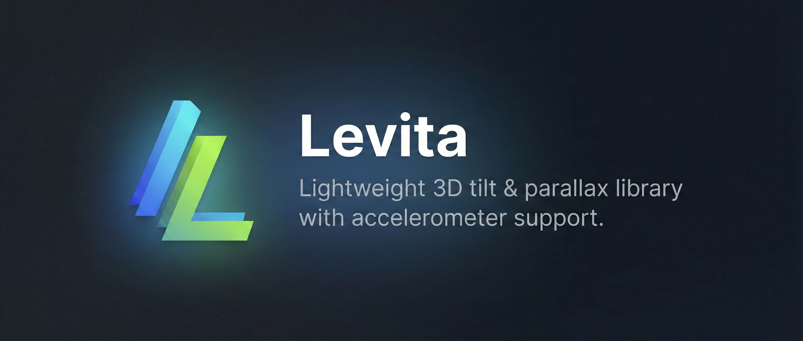
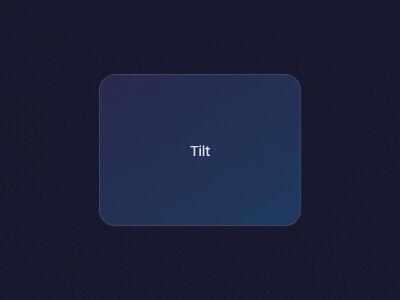
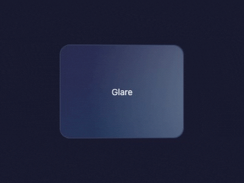
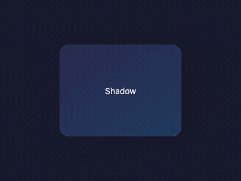
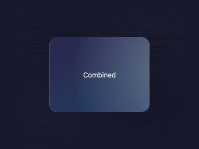

<!-- markdownlint-disable MD033 MD041 -->

<p align="center">
  <a href="https://github.com/jeromearsene/levita" target="_blank" rel="noopener noreferrer">
    
  </a>
</p>

<p align="center">
  <a href="https://github.com/jeromearsene/levita/actions/workflows/ci.yml" target="_blank" rel="noopener noreferrer"></a>
  <a href="https://www.npmjs.com/package/levita-js" target="_blank" rel="noopener noreferrer"></a>
  <a href="https://www.npmjs.com/package/levita-js" target="_blank" rel="noopener noreferrer"></a>
  <a href="https://github.com/jeromearsene/levita/actions/workflows/ci.yml" target="_blank" rel="noopener noreferrer"></a>
  <a href="https://stackblitz.com/github/jeromearsene/levita/tree/main/examples/vanilla" target="_blank" rel="noopener noreferrer"></a>
  <a href="./LICENSE"></a>
  <a href="https://jeromearsene.github.io/levita/" target="_blank" rel="noopener noreferrer"></a>
</p>

- **CSS-driven** — No `requestAnimationFrame` loop. CSS custom properties + compositor = GPU-accelerated.
- **~2KB gzipped** — Core engine only.
- **Accelerometer** — Auto-detects gyroscope, handles iOS permissions transparently.
- **Multi-layer parallax** — `data-levita-offset` on children for depth layering.
- **Framework first** — Official, lightweight wrappers for React, Vue, Svelte & Angular. [See examples](https://jeromearsene.github.io/levita/#playground).
- **Styling agnostic** — Works with any CSS framework (Tailwind, Bootstrap, etc.) or vanilla CSS. [See examples](https://jeromearsene.github.io/levita/#styling).

## Table of Contents

-  [Ecosystem](#ecosystem)
-  [Effects](#effects)
-  [Install](#install)
-  [Quick Start](#quick-start)
  - [Vanilla](#vanilla)
  - [React](#react)
  - [Vue](#vue)
  - [Svelte](#svelte)
  - [Angular](#angular)
-  [Parallax Layers](#parallax-layers)
-  [Grouped Instances](#grouped-instances)
-  [Accelerometer](#accelerometer)
-  [Options](#options)
-  [Events](#events)
-  [Methods](#methods)
-  [How It Works](#how-it-works)
-  [Comparison](#comparison)
-  [Benchmarks](#benchmarks)
-  [Contributing](#contributing)
-  [License](#license)

## Ecosystem

Levita is designed to be framework-agnostic. Choose your flavor:

| Framework | Min Version | Size (gzip) | Playground |
| :--- | :--- | :--- | :--- |
|  **[Vanilla JS](#vanilla)** | **-** |  | [](https://stackblitz.com/github/jeromearsene/levita/tree/main/examples/vanilla) |
|  **[React](#react)** |  |  | [](https://stackblitz.com/github/jeromearsene/levita/tree/main/examples/react) |
|  **[Vue](#vue)** |  |  | [](https://stackblitz.com/github/jeromearsene/levita/tree/main/examples/vue) |
|  **[Svelte](#svelte)** |  |  | [](https://stackblitz.com/github/jeromearsene/levita/tree/main/examples/svelte) |
|  **[Angular](#angular)** |  |  | [](https://stackblitz.com/github/jeromearsene/levita/tree/main/examples/angular) |

## Effects

| Tilt | Glare |
| :---: | :---: |
|  |  |
| **Shadow** | **Combined** |
|  |  |

## Install

```bash
# Core (vanilla JS/TS)
npm install levita-js

# React wrapper
npm install @levita-js/react

# Vue wrapper
npm install @levita-js/vue

# Svelte wrapper
npm install @levita-js/svelte

# Angular wrapper
npm install @levita-js/angular
```

## Quick Start

<a name="vanilla"></a>

### Vanilla

```typescript
import { Levita } from "levita-js";
import "levita-js/style.css";

new Levita(document.getElementById("card"), {
  glare: true,
  shadow: true,
});
```

[](https://stackblitz.com/github/jeromearsene/levita/tree/main/examples/vanilla)

<a name="react"></a>

### React

```tsx
import { Tilt } from "@levita-js/react";
import "levita-js/style.css";

function Card() {
  return (
    <Tilt glare shadow>
      <h2>Hello</h2>
    </Tilt>
  );
}
```

[](https://stackblitz.com/github/jeromearsene/levita/tree/main/examples/react)

<a name="vue"></a>

### Vue

```vue
<script setup>
import { Tilt } from "@levita-js/vue";
import "levita-js/style.css";
</script>

<template>
  <Tilt glare shadow>
    <h2>Hello</h2>
  </Tilt>
</template>
```

[](https://stackblitz.com/github/jeromearsene/levita/tree/main/examples/vue)

<a name="svelte"></a>

### Svelte

```svelte
<script>
  import { tilt } from "@levita-js/svelte";
  import "levita-js/style.css";
</script>

<div use:tilt={{ glare: true, shadow: true }}>
  <h2>Hello</h2>
</div>
```

[](https://stackblitz.com/github/jeromearsene/levita/tree/main/examples/svelte)

<a name="angular"></a>

### Angular

```typescript
import { LevitaDirective } from "@levita-js/angular";
import "levita-js/style.css";

@Component({
  selector: "app-card",
  standalone: true,
  imports: [LevitaDirective],
  template: `
    <div [levita]="{ glare: true, shadow: true }">
      <h2>Hello</h2>
    </div>
  `,
})
export class CardComponent {}
```

[](https://stackblitz.com/github/jeromearsene/levita/tree/main/examples/angular)

## Parallax Layers

Add `data-levita-offset` to children for multi-depth parallax. Positive values come forward, negative go back:

```html
<div id="scene">
  
  
  
</div>
```

```typescript
new Levita(document.getElementById("scene"));
```

## Grouped Instances

You can make multiple Levita instances react to the same pointer movement by using the `eventsEl` option. This is useful for grids where all cards should tilt together:

```typescript
const container = document.getElementById("grid-container");
const cards = document.querySelectorAll(".card");

for (const card of cards) {
  new Levita(card, { eventsEl: container });
}
```

## Accelerometer

Levita auto-detects accelerometer support:

- **Android** — works immediately, no permission needed.
- **iOS 13+** — permission requested on first touch (silent fallback if denied).

```typescript
// Auto mode (default) — handles everything
new Levita(el, { gyroscope: "auto" });

// Manual mode — you control when to ask
const instance = new Levita(el, { gyroscope: true });
button.addEventListener("click", async () => {
  const granted = await instance.requestPermission();
  console.log("Gyroscope:", granted ? "enabled" : "denied");
});

// Disabled
new Levita(el, { gyroscope: false });
```

## Options

| Option | Type | Default | Description |
| --- | --- | --- | --- |
| `max` | `number` | `15` | Max tilt angle in degrees |
| `perspective` | `number` | `1000` | CSS perspective in px |
| `scale` | `number` | `1.05` | Scale factor on hover |
| `speed` | `number` | `200` | Transition duration in ms |
| `easing` | `string` | `'ease-out'` | CSS easing function |
| `reverse` | `boolean` | `false` | Invert tilt direction |
| `axis` | `'x' \| 'y' \| null` | `null` | Lock to single axis |
| `reset` | `boolean` | `true` | Reset on pointer leave |
| `glare` | `boolean` | `false` | Enable glare effect |
| `maxGlare` | `number` | `0.5` | Max glare opacity (0-1) |
| `shadow` | `boolean` | `false` | Enable dynamic shadow |
| `gyroscope` | `'auto' \| boolean` | `'auto'` | Accelerometer mode |
| `disabled` | `boolean` | `false` | Disable the effect |
| `eventsEl` | `HTMLElement \| null` | `null` | Element to listen for events on |

## Events

```typescript
const instance = new Levita(el);

instance.on("move", ({ x, y, percentX, percentY }) => {
  console.log(`Tilt: ${x}°, ${y}°`);
});

instance.on("enter", () => console.log("Pointer entered"));
instance.on("leave", () => console.log("Pointer left"));

// Remove listener
instance.off("move", handler);
```

## Methods

```typescript
instance.enable(); // Re-enable after disable
instance.disable(); // Pause and reset
instance.destroy(); // Full cleanup
await instance.requestPermission(); // Manual gyroscope permission
```

## How It Works

Unlike vanilla-tilt (which runs a `requestAnimationFrame` loop), Levita uses **CSS custom properties**:

1. JS calculates tilt angle from input (pointer or accelerometer)
2. Sets `--levita-x` and `--levita-y` on the element
3. CSS `transform` and `transition` handle the rest on the **GPU compositor thread**

This means:

- No JS running between frames
- Browser optimizes the animation path
- Lower CPU usage, smoother results

## Comparison

| Feature | **Levita** | Atropos | vanilla-tilt |
| --- | --- | --- | --- |
| Bundle size (gzip) | **~2KB** | ~2KB | ~3-4KB |
| Animation | **CSS custom props** | CSS transitions | rAF loop |
| Tree-shakeable | **✅** | ❌ | ❌ |
| Multi-layer parallax | **✅ (data attrs)** | ✅ (data attrs) | ❌ (manual) |
| Accelerometer | **Auto + manual** | ❌ | Partial (buggy) |
| React | **Official** | Official | Community |
| Vue | **Official** | Web Component | Community |
| Svelte | **Official** | ❌ | ❌ |
| Angular | **Official** | Web Component | Community |
| TypeScript | **Native** | Built-in types | External types |
| Maintained | **✅** | ❌ | ❌ |

## Benchmarks

Measured with [Vitest bench](https://vitest.dev/guide/features.html#benchmarking) (happy-dom):

| Scenario | ops/s |
| --- | --- |
| Basic init + destroy |  |
| Init with glare + shadow |  |
| Init with 5 parallax layers |  |
| Pointer move update |  |
| Pointer move with glare + shadow |  |

Run locally: `pnpm bench`

> Automatically updated at each release.

## Contributing

Levita is a monorepo managed with pnpm. For details on how to set up the development environment, run tests, and understand our release workflow, check out our [Development Guide](./DEVELOPMENT.md).

## Sponsors

If you find Levita useful, consider supporting its development:

[](https://buymeacoffee.com/jeromearsene)
[](https://github.com/sponsors/jeromearsene)

## Star History

[](https://star-history.com/#jeromearsene/levita&Date)

## License

MIT
