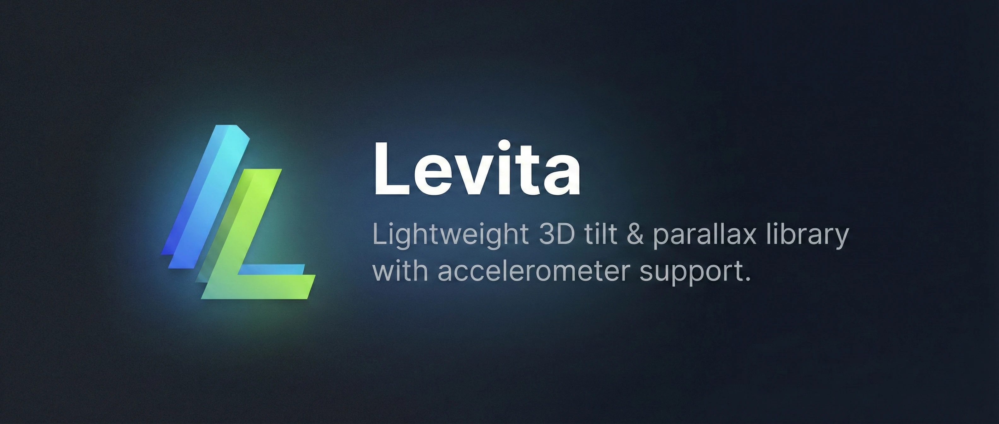
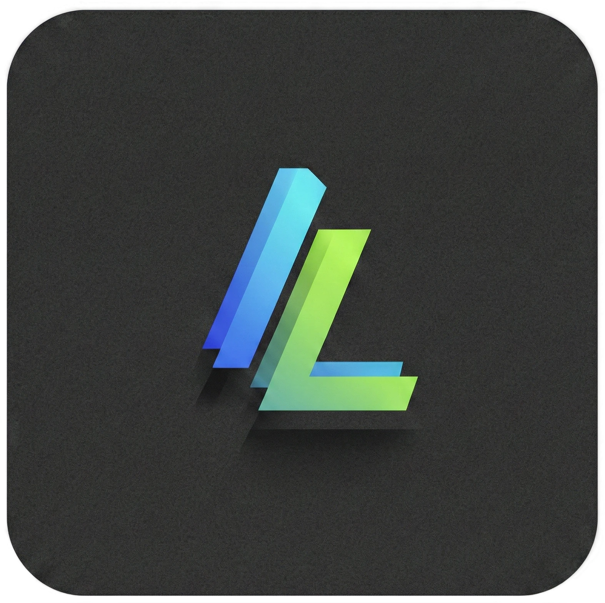
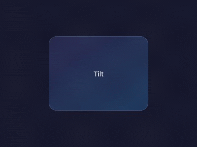
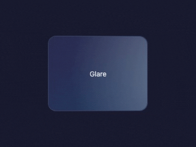
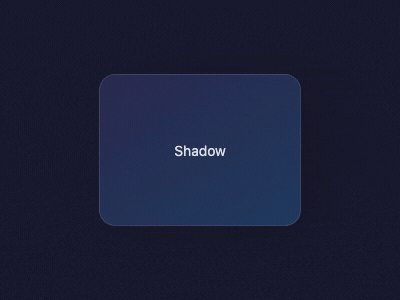
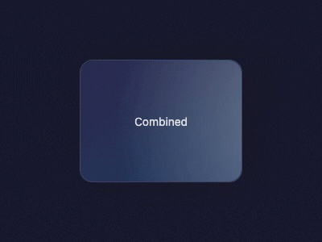

<!-- markdownlint-disable MD033 MD041 -->

<p align="center">
  <a href="https://github.com/jeromearsene/levita" target="_blank" rel="noopener noreferrer">
    
  </a>
</p>

<p align="center">
  
</p>

<h1 align="center">Levita</h1>

<p align="center">
  <strong>Lightweight 3D tilt & parallax library with accelerometer support.</strong>
  <br>
  Zero dependencies. High performance. Mobile ready.
</p>

<p align="center">
  <a href="https://www.npmjs.com/package/@levita-js/core"></a>
  <a href="https://github.com/jeromearsene/levita/blob/main/LICENSE"></a>
  <a href="https://jeromearsene.github.io/levita/coverage/"></a>
</p>

<p align="center">
  <a href="#features">Features</a> •
  <a href="#ecosystem">Ecosystem</a> •
  <a href="#effects">Effects</a> •
  <a href="https://jeromearsene.github.io/levita/">Interactive Demo</a>
</p>

---

## Features

- 🚀 **Framework Agnostic**: Works with React, Vue, Svelte, Angular, or Vanilla JS.
- 📱 **Mobile Ready**: Built-in support for device orientation (accelerometer).
- ⚡ **High Performance**: Optimized with `requestAnimationFrame` and CSS transforms.
- 🎨 **Rich Effects**: Configurable tilt, glare, shadow, and parallax layers.
- 📦 **Ultra Light**: < 2kB minified and gzipped.
- 🛠 **Type Safe**: Written in TypeScript.

## Ecosystem

Levita is designed to be framework-agnostic. Choose your flavor:

| Framework | Min Version | Size (gzip) | Playground |
| :--- | :--- | :--- | :--- |
| <picture><source media="(prefers-color-scheme: dark)" srcset="https://api.iconify.design/lucide:file-code.svg?color=%23ffffff"></picture> **[Vanilla JS](#vanilla)** | **-** |  | [](https://stackblitz.com/github/jeromearsene/levita/tree/main/examples/vanilla) |
| <picture><source media="(prefers-color-scheme: dark)" srcset="https://api.iconify.design/lucide:atom.svg?color=%23ffffff"></picture> **[React](#react)** |  |  | [](https://stackblitz.com/github/jeromearsene/levita/tree/main/examples/react) |
| <picture><source media="(prefers-color-scheme: dark)" srcset="https://api.iconify.design/lucide:layers.svg?color=%23ffffff"></picture> **[Vue](#vue)** |  |  | [](https://stackblitz.com/github/jeromearsene/levita/tree/main/examples/vue) |
| <picture><source media="(prefers-color-scheme: dark)" srcset="https://api.iconify.design/lucide:zap.svg?color=%23ffffff"></picture> **[Svelte](#svelte)** |  |  | [](https://stackblitz.com/github/jeromearsene/levita/tree/main/examples/svelte) |
| <picture><source media="(prefers-color-scheme: dark)" srcset="https://api.iconify.design/lucide:box.svg?color=%23ffffff"></picture> **[Angular](#angular)** |  |  | [](https://stackblitz.com/github/jeromearsene/levita/tree/main/examples/angular) |

## Effects

| Tilt | Glare |
| :---: | :---: |
|  |  |
| **Shadow** | **Combined** |
|  |  |
## Install

```bash
# Core (vanilla JS/TS)
npm install @levita-js/core

# React wrapper
npm install @levita-js/react

# Vue wrapper
npm install @levita-js/vue

# Svelte wrapper
npm install @levita-js/svelte

# Angular wrapper
npm install @levita-js/angular
```

## Quick Start

<a name="vanilla"></a>

### Vanilla

```typescript
import { Levita } from "@levita-js/core";
import "@levita-js/core/style.css";

new Levita(document.getElementById("card"), {
  glare: true,
  shadow: true,
});
```

[](https://stackblitz.com/github/jeromearsene/levita/tree/main/examples/vanilla)

<a name="react"></a>

### React

```tsx
import { Tilt } from "@levita-js/react";
import "@levita-js/react/style.css";

function Card() {
  return (
    <Tilt glare shadow>
      <h2>Hello</h2>
    </Tilt>
  );
}
```

[](https://stackblitz.com/github/jeromearsene/levita/tree/main/examples/react)

<a name="vue"></a>

### Vue

```vue
<script setup>
import { Tilt } from "@levita-js/vue";
import "@levita-js/vue/style.css";
</script>

<template>
  <Tilt glare shadow>
    <h2>Hello</h2>
  </Tilt>
</template>
```

[](https://stackblitz.com/github/jeromearsene/levita/tree/main/examples/vue)

<a name="svelte"></a>

### Svelte

```svelte
<script>
  import { tilt } from "@levita-js/svelte";
  import "@levita-js/svelte/style.css";
</script>

<div use:tilt={{ glare: true, shadow: true }}>
  <h2>Hello</h2>
</div>
```

[](https://stackblitz.com/github/jeromearsene/levita/tree/main/examples/svelte)

<a name="angular"></a>

### Angular

```typescript
import { LevitaDirective } from "@levita-js/angular";
import "@levita-js/angular/style.css";

@Component({
  selector: "app-card",
  standalone: true,
  imports: [LevitaDirective],
  template: `
    <div [levita]="{ glare: true, shadow: true }">
      <h2>Hello</h2>
    </div>
  `,
})
export class CardComponent {}
```

[](https://stackblitz.com/github/jeromearsene/levita/tree/main/examples/angular)

## Parallax Layers

Add `data-levita-offset` to children for multi-depth parallax. Positive values come forward, negative go back:

```html
<div id="scene">
  
  
  
</div>
```

```typescript
new Levita(document.getElementById("scene"));
```

## Active Offset (Discovery Effect)

The "Active Offset" effect creates a "window" illusion where the background image moves in the opposite direction of the tilt, revealing hidden edges.

1. Enable it via the `activeOffset` option (in pixels).
2. Add `data-levita-active` to the background element.
3. **Automatic Scaling**: Levita automatically calculates and applies the minimum required `scale()` to the element so that hidden edges are revealed during tilt without showing gaps.

```html
<div id="card" style="overflow: hidden; border-radius: 12px;">
  <!-- Levita handles the zoom and movement automatically -->
  
  <h2 data-levita-offset="20">Floating Text</h2>
</div>
```

```typescript
new Levita(document.getElementById("card"), {
  activeOffset: 20, // Move bg up to 20px to reveal edges
});
```

## Grouped Instances

You can make multiple Levita instances react to the same pointer movement by using the `eventsEl` option. This is useful for grids where all cards should tilt together:

```typescript
const container = document.getElementById("grid-container");
const cards = document.querySelectorAll(".card");

for (const card of cards) {
  new Levita(card, { eventsEl: container });
}
```

## Accelerometer

Levita auto-detects accelerometer support:

- **Android** — works immediately, no permission needed.
- **iOS 13+** — permission requested on first touch (silent fallback if denied).

```typescript
// Auto mode (default) — handles everything
new Levita(el, { gyroscope: "auto" });

// Manual mode — you control when to ask
const instance = new Levita(el, { gyroscope: true });
button.addEventListener("click", async () => {
  const granted = await instance.requestPermission();
  console.log("Gyroscope:", granted ? "enabled" : "denied");
});

// Disabled
new Levita(el, { gyroscope: false });
```

### Fine-tuning gyroscope behavior

```typescript
new Levita(el, {
  gyroscope: "auto",
  gyroRange: 40, // More reactive (less tilt needed)
  gyroSmoothing: 0.1, // Smoother movement
});
```

- `gyroRange` — Total physical tilt range in degrees mapped to full effect. Lower = more reactive. Default: `60`.
- `gyroSmoothing` — Exponential moving average factor. Lower = smoother but more latent. Default: `0.15`.

## Options

| Option | Type | Default | Description |
| --- | --- | --- | --- |
| `max` | `number` | `15` | Max tilt angle in degrees |
| `perspective` | `number` | `1000` | CSS perspective in px |
| `scale` | `number` | `1.05` | Scale factor on hover |
| `speed` | `number` | `200` | Transition duration in ms |
| `easing` | `string` | `'ease-out'` | CSS easing function |
| `reverse` | `boolean` | `false` | Invert tilt direction |
| `axis` | `'x' \| 'y' \| null` | `null` | Lock to single axis |
| `reset` | `boolean` | `true` | Reset on pointer leave |
| `glare` | `boolean` | `false` | Enable glare effect |
| `maxGlare` | `number` | `0.5` | Max glare opacity (0-1) |
| `shadow` | `boolean` | `false` | Enable dynamic shadow |
| `gyroscope` | `'auto' \| boolean` | `'auto'` | Accelerometer mode |
| `gyroRange` | `number` | `60` | Physical tilt range in degrees |
| `gyroSmoothing` | `number` | `0.15` | Sensor smoothing factor (0-1) |
| `activeOffset` | `number` | `0` | Active parallax offset for backgrounds in px |
| `disabled` | `boolean` | `false` | Disable the effect |
| `eventsEl` | `HTMLElement \| null` | `null` | Element to listen for events on |

## Events

```typescript
const instance = new Levita(el);

instance.on("move", ({ x, y, percentX, percentY }) => {
  console.log(`Tilt: ${x}°, ${y}°`);
});

instance.on("enter", () => console.log("Pointer entered"));
instance.on("leave", () => console.log("Pointer left"));

// Remove listener
instance.off("move", handler);
```

## Methods

```typescript
instance.enable(); // Re-enable after disable
instance.disable(); // Pause and reset
instance.destroy(); // Full cleanup
await instance.requestPermission(); // Manual gyroscope permission
```

## How It Works

Most tilt libraries (like vanilla-tilt) run a `requestAnimationFrame` loop that recalculates and applies the transform matrix on every frame in JavaScript. This means JS is active between every frame, and high-polling-rate mice (1000Hz+) can flood the main thread with style recalculations.

Levita takes a different approach with **CSS custom properties**:

1. Pointer or accelerometer input fires → JS computes the tilt angle
2. Updates are **coalesced via `requestAnimationFrame`** — even if the mouse fires 1000 events/sec, only one DOM update happens per frame
3. JS sets `--levita-x` and `--levita-y` as CSS custom properties on the element
4. A CSS `transform` rule reads those properties, and `transition` smooths the movement — entirely on the **GPU compositor thread**

```text
pointer/gyro event (may fire at 1000Hz)
  │
  ▼
rAF coalescing (1 update per frame)
  │
  ▼
JS sets --levita-x, --levita-y  ← only JS work
  │
  ▼
CSS transform + transition       ← GPU compositor, no JS
```

The result:

- **No JS between frames** — JavaScript only runs when input changes, once per frame
- **GPU-accelerated** — the browser's compositor thread handles the animation
- **High-polling-rate safe** — 1000Hz mice don't saturate the main thread
- **Lower CPU usage** — measured via Vitest bench, see [Benchmarks](#benchmarks)

## Comparison

| Feature               | Levita                     | Atropos             | vanilla-tilt               |
| --------------------- | -------------------------- | ------------------- | -------------------------- |
| Bundle size (gzip)    | ~2KB                       | ~2KB                | ~3-4KB                     |
| Animation strategy    | CSS custom properties      | CSS transitions     | rAF loop                   |
| Tree-shakeable        | ✅                         | ❌                  | ❌                         |
| Multi-layer parallax  | ✅ (data attrs)            | ✅ (data attrs)     | ❌                         |
| Accelerometer         | Auto + manual (calibrated) | ❌                  | Partial (no calibration)   |
| Grouped instances     | ✅ (`eventsEl`)            | ✅ (`stretchX/Y/Z`) | ✅ (`mouse-event-element`) |
| Runtime option update | ✅ (`update()`)            | ❌                  | ❌                         |
| React                 | Official wrapper           | Official wrapper    | Community                  |
| Vue                   | Official wrapper           | Web Component       | Community                  |
| Svelte                | Official wrapper           | ❌                  | ❌                         |
| Angular               | Official wrapper           | Web Component       | Community                  |
| TypeScript            | Native (source in TS)      | Declaration file    | DefinitelyTyped            |
| Last published        | 2026                       | 2023                | 2021                       |

## Benchmarks

Measured with [Vitest bench](https://vitest.dev/guide/features.html#benchmarking) (happy-dom):

| Scenario                         | ops/s                                                                                                                                      |
| -------------------------------- | ------------------------------------------------------------------------------------------------------------------------------------------ |
| Basic init + destroy             |                      |
| Init with glare + shadow         |          |
| Init with 5 parallax layers      |              |
| Pointer move update              |             |
| Pointer move with glare + shadow |  |

Run locally: `pnpm bench`

> Automatically updated at each release.

## Contributing

Levita is a monorepo managed with pnpm. For details on how to set up the development environment, run tests, and understand our release workflow, check out our [Development Guide](./DEVELOPMENT.md).

## Sponsors

If you find Levita useful, consider supporting its development:

[](https://buymeacoffee.com/jeromearsene)
[](https://github.com/sponsors/jeromearsene)

## Star History

[](https://star-history.com/#jeromearsene/levita&Date)

## Roadmap

Interested in what's coming next? You can follow the development progress and upcoming features on our public project board:

[](https://github.com/users/Jeromearsene/projects/7)

## License

MIT
