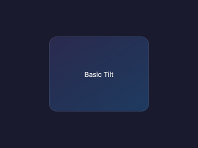
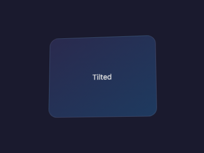
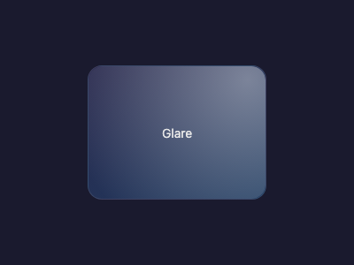
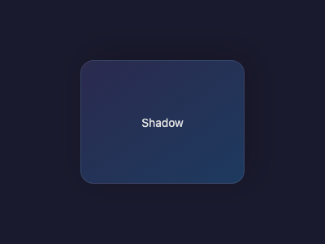
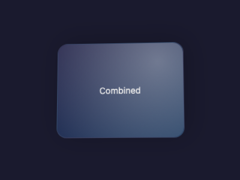
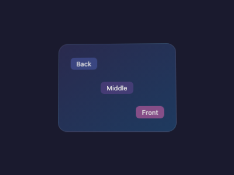

# Visual Effects Reference

> Screenshots are generated by Playwright visual tests (`pnpm test:visual:update`).
> Animated GIFs are recorded with `pnpm test:visual:record`.

## Animations

### Tilt

### Glare

### Shadow

### Combined (Glare + Shadow)

## Static Snapshots

### Basic Tilt (at rest)

The card at its neutral position, with no tilt applied.

### Tilt Applied

Card tilted at 10deg X / -8deg Y with scale 1.05.

### Glare Effect

Light reflection overlay following a simulated cursor position (70%, 30%).

### Shadow Effect

Dynamic drop shadow offset based on tilt angle.

### Glare + Shadow Combined

Both effects active simultaneously with a tilted card.

### Parallax Layers

Multi-depth layers positioned at different Z offsets (-5, 0, 10).

